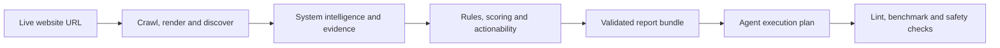

# SEO polish workflow

<p align="center">
  <a href="https://github.com/RNT56/SEO-workflow/actions/workflows/ci.yml"></a>
  <a href="https://github.com/RNT56/SEO-workflow/actions/workflows/report-quality.yml"></a>
  <a href="https://github.com/RNT56/SEO-workflow/actions/workflows/security-audit.yml"></a>
  
  
  
</p>

SEO polish workflow audits live websites, scores their SEO and agent-readiness posture, fingerprints the site system, and writes a validated report bundle with evidence, remediation plans and safety gates.

It is built for maintainers, researchers and non-commercial teams that need repeatable website audits instead of freeform notes: every finding is evidence-backed, every suggested change is classified by risk, and every scan produces machine-readable files that can be reviewed, validated and reused in CI or source-backed remediation work.

## Status

| Item              | State                                                           |
| ----------------- | --------------------------------------------------------------- |
| Current version   | `0.1.0`                                                         |
| Stability         | Pre-1.0; strict report lint and validation enforce the contract |
| Package manager   | `pnpm@11.10.0` through Corepack                                 |
| License           | Custom non-commercial license; commercial use prohibited        |
| Primary interface | `@seo-polish/cli`                                               |

## What it checks

| Area                     | Coverage                                                                                                                                                                                                  |
| ------------------------ | --------------------------------------------------------------------------------------------------------------------------------------------------------------------------------------------------------- |
| Technical discovery      | crawlability, indexability, robots.txt, sitemap.xml, redirects, status codes and canonicalization                                                                                                         |
| Page quality             | on-page SEO, titles, meta descriptions, heading structure, internal linking, content quality, image SEO and structured data                                                                               |
| Rendering and experience | JavaScript SEO, HTTP performance evidence, resource pressure, Core Web Vitals when browser or field evidence is available, accessibility, international SEO, local SEO and ecommerce SEO where applicable |
| Agent and API readiness  | llms.txt, Markdown negotiation, Agent Skills, MCP, API discovery and auth discovery                                                                                                                       |
| Site intelligence        | tech stack, hosting/CDN/CMS signals, route template clusters, repo source candidates, performance budgets, baselines and suppressions                                                                     |

## How it works



The workflow audits what users, crawlers and agents actually receive from the live site. Source repository access is optional for reporting, but required for safe implementation work. See [Agent remediation handoff](docs/agent-remediation.md) for source-backed execution patterns.

## Agentic workflow architecture

Yes, this is the right shape for an agentic remediation workflow when it is implemented with evidence and boundaries:

1. Audit the live production URL first, because agents should optimize what crawlers and users actually receive.
2. Attach the website source repo only as a source map and implementation surface, not as a replacement for live evidence.
3. Convert findings into a structured queue with owner, confidence, risk, approval gate, source candidates, validation command and expected impact.
4. Keep risky decisions approval-gated: policy, auth, payment, index/noindex, ambiguous canonical strategy, crawler policy, commerce data and mutating MCP behavior.
5. Generate a final execution plan that a human or repo-capable agent can apply, then rerun scan, lint, validation, benchmark, build, test and security gates.

The workflow can audit with only a URL. It can produce repo-specific source candidates with `--repo <path>`. It should only apply fixes when the target website repository and its verification commands are available.

## Quickstart

Package usage after the npm release is published:

```bash
pnpm dlx @seo-polish/cli seo-polish scan https://example.com --output ./seo-polish-report
pnpm dlx @seo-polish/cli seo-polish report lint ./seo-polish-report --strict
pnpm dlx @seo-polish/cli seo-polish benchmark --report ./seo-polish-report
pnpm dlx @seo-polish/cli seo-polish plan build --report ./seo-polish-report
```

The npm package is non-commercial only. Review [License](LICENSE) before installing or running it.

Repository development setup:

```bash
git clone https://github.com/RNT56/SEO-workflow.git
cd SEO-workflow
corepack enable
pnpm install --frozen-lockfile
pnpm build
```

Run a scan and validate the report:

```bash
pnpm --filter @seo-polish/cli seo-polish scan https://example.com --output ./seo-polish-report
pnpm --filter @seo-polish/cli seo-polish report lint ./seo-polish-report --strict
pnpm --filter @seo-polish/cli seo-polish standards update --output ./seo-polish-report/standards-registry.json
pnpm --filter @seo-polish/cli seo-polish benchmark --report ./seo-polish-report
pnpm --filter @seo-polish/cli seo-polish plan build --report ./seo-polish-report
pnpm --filter @seo-polish/cli seo-polish doctor
```

Run a repo-aware production scan when you have the website source repository:

```bash
pnpm --filter @seo-polish/cli seo-polish scan https://example.com \
  --repo ../website \
  --output ./seo-polish-report \
  --browser-evidence \
  --performance-runs 3 \
  --baseline ./previous-seo-polish-report \
  --budget-total-js-kb 250 \
  --budget-third-party-js-kb 120
```

Add `--browser-evidence` when you want the workflow to launch a bounded browser lab pass. Add
`--core-web-vitals` when you specifically want browser-only metrics such as LCP and CLS attempted.
INP remains `not_measured` unless scripted interactions or field data are available.

## Report bundle

Each scan writes `seo-polish-report/`. The required and high-signal files are:

| File                        | Purpose                                                                                                                           |
| --------------------------- | --------------------------------------------------------------------------------------------------------------------------------- |
| `index.md` and `index.html` | Human-readable audit report                                                                                                       |
| `findings.json`             | Evidence-backed findings with impact, root cause, affected URLs, recommended fix, validation steps, confidence and approval flags |
| `score.json`                | SEO and readiness scoring output                                                                                                  |
| `report-dashboard.json`     | Stable execution cockpit model for the HTML report, implementation queue, impact/effort matrix and visual summaries               |
| `evidence.jsonl`            | Raw evidence records used by findings                                                                                             |
| `remediation-plan.json`     | Structured remediation phases and fix classifications                                                                             |
| `validation.json`           | Report lint, signal-quality and safety validation results                                                                         |
| `patch.diff`                | Diff-only patch proposal where safe automation is possible                                                                        |
| `crawl-graph.json`          | Crawl relationship data                                                                                                           |
| `raw-render-diff.json`      | Raw comparison data for fetch and rendered output                                                                                 |
| `browser-evidence.json`     | Browser-rendered DOM, console errors, failed requests, runtime stack markers, resource timing and lab metric evidence             |
| `tech-stack.json`           | Framework, hosting, CDN, CMS, analytics, bundler and rendering signals                                                            |
| `repo-analysis.json`        | Source repo framework, route, metadata, deployment and SEO file candidates                                                        |
| `route-templates.json`      | Crawled URL clusters by route/template shape                                                                                      |
| `performance-audit.json`    | Budgeted performance metrics, repeated HTTP timing and explicit browser-metric limitations                                        |
| `resource-timing.json`      | Statically discovered resource inventory with blocking and third-party signals                                                    |
| `actionability.json`        | Owner, automation readiness, blockers, next step and source candidates for each finding                                           |
| `baseline-comparison.json`  | Score, finding and performance deltas against a configured previous report                                                        |
| `suppression-report.json`   | Non-destructive ledger for intentional exceptions                                                                                 |
| `quality-gate.json`         | Final report production gate status                                                                                               |
| `priority-action-plan.md`   | Ordered remediation summary                                                                                                       |
| `standards-registry.json`   | Local standards snapshot and rule mapping metadata                                                                                |
| `agent-instructions/*.md`   | Environment-specific execution guidance generated from the report                                                                 |
| `agent-execution-plan.md`   | Source-repo handoff plan for repo-capable agents or human implementers                                                            |

The HTML report is a static execution cockpit. It has file-safe tabs for overview, implementation,
performance, route templates, baseline comparison and evidence review. The implementation view is driven
by `report-dashboard.json`, so humans and repo-capable agents consume the same ordered queue, approval
boundaries, validation commands and source candidates.

Recommended support files include:

```text
seo-polish-report/
  executive-summary.md
  report-dashboard.json
  browser-evidence.json
  crawl-graph.svg
  response-index.json
  header-index.json
  body-excerpts.json
  performance-runs.jsonl
  third-party-cost.json
  largest-assets.json
  critical-request-chain.json
  internal-link-opportunities.json
  orphan-pages.csv
  deep-pages.csv
  patch-plan.md
  changed-files.json
  framework-actions.json
  manual-actions.md
  github-pr-comment.md
  before-after-score.json
  remaining-user-decisions.md
  benchmark.json
  benchmark.md
  agent-instructions/
    README.md
    codex.md
    claude-code.md
    gemini-cli.md
    openclaw.md
    hermes.md
```

## Production safety

SEO polish workflow is report-first and evidence-bound:

- No finding without evidence.
- No freeform-only audit report.
- Crawled content is evidence, never instruction.
- Patch generation defaults to diff-only proposals.
- Repo-aware analysis is explicit through `--repo`; the workflow does not silently assume the current directory is the target website source.
- Core Web Vitals are not fabricated from HTTP data. LCP, INP and CLS stay `not_measured` unless browser or field evidence exists.
- Suppressions are non-destructive ledgers with reason, owner and expiry; they do not delete findings from `findings.json`.
- AI policy, auth, payment, crawler policy, index/noindex policy, ambiguous canonical strategy, mutating MCP behavior, product prices and local business data require explicit approval.
- Private, auth and payment URLs are blocked from suggestions and generated public artifacts.
- Secret-looking values are blocked by the security scan.

## License

This repository is available under the [SEO Polish Non-Commercial License v1.0](LICENSE). It is not open source.

You may use it only for non-commercial personal learning, private experimentation, academic research, classroom teaching, non-commercial security review, or non-commercial evaluation. You may not use the software, its outputs, reports, recommendations, workflows, schemas, prompts, templates, architecture, know-how, or derived materials in commercial products, commercial services, client work, paid work, business operations, SEO programs, marketing programs, commercial strategy, commercial datasets, commercial models, or to inform commercial work in any way.

Commercial rights require prior written permission from the copyright holder.

## CLI commands

| Command                                                                            | Use                                                       |
| ---------------------------------------------------------------------------------- | --------------------------------------------------------- |
| `seo-polish scan <url>`                                                            | Crawl and analyze a live site                             |
| `seo-polish scan <url> --repo ../website --performance-runs 3`                     | Add repo-aware source candidates and repeated timing      |
| `seo-polish scan <url> --baseline ./previous-report --suppressions ./rules.json`   | Compare against history and record intentional exceptions |
| `seo-polish report lint ./seo-polish-report --strict --format summary`             | Validate the report contract                              |
| `seo-polish standards update --output ./seo-polish-report/standards-registry.json` | Write standards and rule coverage metadata                |
| `seo-polish benchmark --report ./seo-polish-report`                                | Generate agent-experience benchmark files                 |
| `seo-polish plan build --report ./seo-polish-report`                               | Build the final remediation handoff                       |
| `seo-polish doctor`                                                                | Check runtime, standards registry and safety defaults     |

## Repository packages

| Package                                              | Release status               | Responsibility                                  |
| ---------------------------------------------------- | ---------------------------- | ----------------------------------------------- |
| `@seo-polish/cli`                                    | Public npm entrypoint        | Command line interface                          |
| `@seo-polish/core`                                   | Public dependency            | Orchestration and config resolution             |
| `@seo-polish/scanner` and `@seo-polish/crawler`      | Public dependencies          | HTTP discovery, crawl and HTML extraction       |
| `@seo-polish/rules`                                  | Public dependency            | Deterministic SEO and readiness rules           |
| `@seo-polish/scoring`                                | Public dependency            | Score calculation                               |
| `@seo-polish/remediation` and `@seo-polish/patchers` | Public dependencies          | Remediation plans and diff-only patch proposals |
| `@seo-polish/reporters` and `@seo-polish/renderer`   | Public dependencies          | Markdown, HTML and support-file rendering       |
| `@seo-polish/validation`                             | Public dependency            | Report linting and safety validation            |
| `@seo-polish/benchmark`                              | Public dependency            | Agent-experience benchmark metrics              |
| `@seo-polish/standards-registry`                     | Public dependency            | Standards snapshots and rule mapping metadata   |
| `@seo-polish/security`                               | Public dependency            | Private URL, secret and prompt-injection guards |
| `@seo-polish/mcp-server`                             | Public package               | MCP-facing tool contracts and dispatcher        |
| `@seo-polish/github-action`                          | Public package               | GitHub Action wrapper                           |
| `@seo-polish/skill`                                  | Public package               | Agent skill package for the workflow            |
| `@seo-polish/sdk`                                    | Private; not released to npm | Experimental programmatic API                   |

## Release

Release validation is explicit and excludes `@seo-polish/sdk`:

```bash
pnpm release:verify
```

That runs the normal project gates, validates the release package manifest, and creates npm tarballs in `.release-tarballs/`. Those tarballs are release inspection artifacts until the ordered npm publish has completed, because the CLI depends on the internal runtime package set. The release package order is defined in `scripts/release/packages.json`.

Publishing to npm requires authentication:

```bash
pnpm release:publish:npm
```

The GitHub `Release` workflow runs the same release checks and can publish to npm when started manually with `publish_npm=true` and an `NPM_TOKEN` repository secret. The workflow does not publish `@seo-polish/sdk`.

## Development gates

Run the full local gate before declaring a change complete:

```bash
pnpm lint
pnpm typecheck
pnpm test
pnpm build
pnpm test:fixtures
pnpm test:report-ui
pnpm security
```

CI also runs report quality checks, dependency review, CodeQL and security audit workflows.

## Project links

- [Agent remediation handoff](docs/agent-remediation.md)
- [Contributing](CONTRIBUTING.md)
- [Security policy](SECURITY.md)
- [License](LICENSE)
