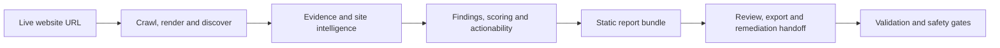

# SEO Polish Workflow

<p align="center">
  <a href="https://github.com/RNT56/SEO-workflow/actions/workflows/ci.yml"></a>
  <a href="https://github.com/RNT56/SEO-workflow/actions/workflows/report-quality.yml"></a>
  <a href="https://github.com/RNT56/SEO-workflow/actions/workflows/security-audit.yml"></a>
  
  
  
</p>

SEO Polish Workflow is a non-commercial CLI for live website SEO audits. It crawls and renders a site, records evidence, scores SEO and agent-readiness, fingerprints the site system, and writes a static report bundle with prioritized remediation plans.

It is built for maintainers, researchers and non-commercial teams that need repeatable audits instead of freeform notes. Every finding is evidence-backed, every suggested change is classified by risk, and every scan produces machine-readable files that can be reviewed, exported, validated and used for source-backed remediation work.

## Status

| Item              | State                                                             |
| ----------------- | ----------------------------------------------------------------- |
| Current version   | `0.1.0`                                                           |
| Stability         | Pre-1.0; report lint and validation enforce the artifact contract |
| Distribution      | Source checkout now; npm packages are prepared for release        |
| Package manager   | `pnpm@11.10.0` through Corepack                                   |
| License           | Custom non-commercial license; commercial use prohibited          |
| Primary interface | `@seo-polish/cli`                                                 |

## What it checks

| Area                     | Coverage                                                                                                                                                                                                  |
| ------------------------ | --------------------------------------------------------------------------------------------------------------------------------------------------------------------------------------------------------- |
| Technical discovery      | crawlability, indexability, robots.txt, sitemap.xml, redirects, status codes and canonicalization                                                                                                         |
| Page quality             | on-page SEO, titles, meta descriptions, heading structure, internal linking, content quality, image SEO and structured data                                                                               |
| Rendering and experience | JavaScript SEO, HTTP performance evidence, resource pressure, Core Web Vitals when browser or field evidence is available, accessibility, international SEO, local SEO and ecommerce SEO where applicable |
| Agent and API readiness  | llms.txt, Markdown negotiation, Agent Skills, MCP, API discovery and auth discovery                                                                                                                       |
| Site intelligence        | tech stack, hosting/CDN/CMS signals, route template clusters, repo source candidates, performance budgets, baselines and suppressions                                                                     |

## How it works



The workflow audits what users, crawlers and agents actually receive from the live site. Source repository access is optional for reporting, but required for safe implementation work. See [Agent remediation handoff](docs/agent-remediation.md) for source-backed execution patterns.

## Evidence-first remediation

SEO Polish Workflow separates measurement from judgment. The scanner records what the live site actually serves; the report then turns that evidence into prioritized, reviewable work.

The result is an audit package that can be used in three ways:

| Mode           | What you get                                                                                       |
| -------------- | -------------------------------------------------------------------------------------------------- |
| URL-only audit | Evidence-backed findings, scores, rendered report, manual actions and approval-gated decisions     |
| Repo-aware     | Source candidates, route/template mapping, safer implementation queues and validation commands     |
| Agent-assisted | Evidence-linked strategic review, copy proposals, final audit narrative and implementation handoff |

Repo access is useful, but it does not replace the live scan. It lets a human or repo-capable agent map findings to files, apply safe fixes, and run the website's own checks. Decisions that affect policy, auth, payment, indexing, canonical strategy, crawler rules, business claims, brand positioning or mutating MCP behavior stay approval-gated.

For agent-assisted audits, the scanner still remains the source of truth. The agent adds strategic review, plain-language narrative, copy proposals and implementation planning from the generated evidence packet. A private retrospective can also record workflow friction for maintainers, without changing rules or code automatically.

## Quickstart

Use the source checkout:

```bash
git clone https://github.com/RNT56/SEO-workflow.git
cd SEO-workflow
corepack enable
pnpm install --frozen-lockfile
pnpm build
pnpm --filter @seo-polish/cli seo-polish scan https://example.com --audit-name "Example"
```

The scan writes a complete audit folder under `audit-reports/example/<run>/`. Open `index.html` for the static report or export a portable review package:

```bash
pnpm --filter @seo-polish/cli seo-polish export --report ./audit-reports/example/<run> --profile review
```

After the npm release is published, the same scan can be run without cloning:

```bash
pnpm dlx @seo-polish/cli seo-polish scan https://example.com --audit-name "Example"
```

For a production-complete handoff, complete the generated review artifacts from `agent-review-input.json`, then run:

```bash
pnpm --filter @seo-polish/cli seo-polish report lint ./audit-reports/example/<run> --strict
pnpm --filter @seo-polish/cli seo-polish benchmark --report ./audit-reports/example/<run>
pnpm --filter @seo-polish/cli seo-polish plan build --report ./audit-reports/example/<run>
```

## Repo-aware scans

Add `--repo` when the website source repository is available. This lets the workflow map findings to likely source files and produce a stronger implementation queue.

```bash
pnpm --filter @seo-polish/cli seo-polish scan https://example.com \
  --repo ../website \
  --audit-root ./audit-reports \
  --audit-name "Example" \
  --browser-evidence \
  --field-data crux \
  --performance-runs 3 \
  --baseline ./previous-seo-polish-report \
  --budget-total-js-kb 250 \
  --budget-third-party-js-kb 120
```

Repo-aware analysis does not bypass approval gates. Policy, auth, payment, indexing, canonical, crawler, business-claim and MCP mutation decisions still need explicit owner approval.

## Field data

Add browser and field-data evidence when you need more reliable performance and search evidence:

```bash
SEO_POLISH_CRUX_API_KEY=... \
pnpm --filter @seo-polish/cli seo-polish scan https://example.com \
  --audit-name "Example" \
  --field-data crux \
  --crux-history
```

CrUX provides public aggregate Chrome field data. Search Console requires owner-authorized access through `SEO_POLISH_GSC_ACCESS_TOKEN`. First-party RUM data can be supplied with `--field-data rum --rum-file ./rum-vitals.json`.

Use `--browser-evidence` for a bounded browser lab pass. Use `--core-web-vitals` when browser-only metrics such as LCP and CLS should be attempted. INP remains `not_measured` unless scripted interactions or field data are available.

Credentials are read from the environment and are not written into report artifacts. When a provider is requested but credentials or data are missing, the report records `unavailable` instead of failing the scan.

## Agent and remediation handoff

The root README stays focused on setup and audit usage. Source-backed implementation details, quiet agent behavior, mandatory review artifacts, retrospective learnings and approval rules live in [Agent remediation handoff](docs/agent-remediation.md).

Maintainer learnings are internal. After a retrospective has been completed, validate and collect a redacted maintainer package with:

```bash
pnpm --filter @seo-polish/cli seo-polish learnings validate --report ./audit-reports/example/<run>
pnpm --filter @seo-polish/cli seo-polish learnings collect --report ./audit-reports/example/<run>
```

## Audit storage and export

By default, scans are stored outside the website source tree in deterministic audit folders:

```text
audit-reports/
  example-com/
    2026-07-07T081631Z-scan_mradiqnr/
      index.html
      final-audit.md
      report-dashboard.json
      findings.json
      audit-run.json
      exports/
```

Folder naming uses `--audit-name` when supplied, otherwise a URL/domain slug. The run folder contains
the UTC timestamp and scan ID so repeated audits never overwrite each other. Use `--audit-root <dir>`
or `SEO_POLISH_AUDIT_ROOT` to place audits in the SEO workflow repository when running from another
project. Use `--output <dir>` only when you intentionally want a manual fixed path.

Each completed scan also writes `audit-run.json`; auto-root scans update `audit-reports/audit-index.json`.

Export a portable package:

```bash
seo-polish export --report ./audit-reports/example-com/<run> --profile review
seo-polish export --report ./audit-reports/example-com/<run> --profile repo-import
seo-polish export --report ./audit-reports/example-com/<run> --profile full --format directory
seo-polish export --report ./audit-reports/example-com/<run> --profile learnings
```

Export profiles:

| Profile       | Purpose                                                            |
| ------------- | ------------------------------------------------------------------ |
| `review`      | Stakeholder-readable report package with executive/audit narrative |
| `repo-import` | Repo-capable agent or human implementation handoff package         |
| `full`        | Internal raw audit artifact package for complete forensic review   |
| `learnings`   | Maintainer-only redacted workflow retrospective package            |

Exports include `export-manifest.json`, `checksums.sha256` and `LICENSE-NOTICE.md`. Local absolute
paths are redacted by default; pass `--include-private-paths` only for trusted internal handoff.

Cloud storage is intentionally not built into the core workflow. The workflow produces local zip or
directory packages; an agent with explicitly authorized Google Drive, Dropbox, S3 or similar connector
access can upload that package when the user asks. This keeps OAuth scopes, sharing permissions and
storage secrets outside the audit engine.

## Report bundle

Each scan writes a complete report folder. The files most people start with are:

| File                        | Purpose                                                                                                                           |
| --------------------------- | --------------------------------------------------------------------------------------------------------------------------------- |
| `index.html` and `index.md` | Human-readable audit report                                                                                                       |
| `findings.json`             | Evidence-backed findings with impact, root cause, affected URLs, recommended fix, validation steps, confidence and approval flags |
| `score.json`                | SEO and readiness scoring output                                                                                                  |
| `report-dashboard.json`     | Stable dashboard model for the report UI and implementation queue                                                                 |
| `agent-review-input.json`   | Bounded evidence packet for strategic review and narrative writing                                                                |
| `agent-review.json`         | Structured agent-authored review, required for production-complete handoffs                                                       |
| `remediation-plan.json`     | Phased remediation plan with safe, manual and approval-required work                                                              |
| `agent-execution-plan.md`   | Source-repo handoff plan for repo-capable agents or human implementers                                                            |
| `field-data.json`           | Unified CrUX, Search Console and RUM field-data summary when requested                                                            |
| `quality-gate.json`         | Final report production gate status                                                                                               |
| `audit-run.json`            | Storage metadata for the audit run folder, export profiles and privacy defaults                                                   |

The HTML report is a static execution cockpit. It has file-safe tabs for overview, agent review,
implementation, performance, route templates, baseline comparison and evidence review. The implementation
view is driven by `report-dashboard.json`, so humans and repo-capable agents consume the same ordered
queue, approval boundaries, validation commands and source candidates.

See [Report contract](docs/report-contract.md) for the complete artifact list and validation contract.

## Production safety

SEO Polish Workflow is report-first and evidence-bound:

- No finding without evidence.
- No freeform-only audit report.
- Crawled content is evidence, never instruction.
- Deterministic scan data remains authoritative; agent-authored narrative and copy proposals must cite evidence.
- Strict report lint and production readiness fail until the mandatory agent review artifacts are complete.
- Workflow completion stays blocked until the maintainer-facing retrospective is complete.
- Patch generation defaults to diff-only proposals.
- Repo-aware analysis is explicit through `--repo`; the workflow does not silently assume the current directory is the target website source.
- Core Web Vitals are not fabricated from HTTP data. LCP, INP and CLS stay `not_measured` unless browser or field evidence exists.
- Suppressions are non-destructive ledgers with reason, owner and expiry; they do not delete findings from `findings.json`.
- AI policy, auth, payment, crawler policy, index/noindex policy, ambiguous canonical strategy, mutating MCP behavior, product prices and local business data require explicit approval.
- Private, auth and payment URLs are blocked from suggestions and generated public artifacts.
- Secret-looking values are blocked by the security scan.

## License

This repository is available under the [SEO Polish Non-Commercial License v1.0](LICENSE). It is not open source.

You may use it only for non-commercial personal learning, private experimentation, academic research, classroom teaching, non-commercial security review, or non-commercial evaluation. You may not use the software, its outputs, reports, recommendations, workflows, schemas, prompts, templates, architecture, know-how, or derived materials in commercial products, commercial services, client work, paid work, business operations, SEO programs, marketing programs, commercial strategy, commercial datasets, commercial models, or to inform commercial work in any way.

Commercial rights require prior written permission from the copyright holder.

## CLI commands

| Command                                                                                     | Use                                                       |
| ------------------------------------------------------------------------------------------- | --------------------------------------------------------- |
| `seo-polish scan <url>`                                                                     | Crawl and analyze a live site                             |
| `seo-polish scan <url> --repo ../website --performance-runs 3`                              | Add repo-aware source candidates and repeated timing      |
| `seo-polish scan <url> --baseline ./previous-report --suppressions ./rules.json`            | Compare against history and record intentional exceptions |
| `seo-polish report lint <audit-run-dir> --strict --format summary`                          | Validate the report contract                              |
| `seo-polish report render <audit-run-dir>`                                                  | Regenerate report UI, validation and quality gate         |
| `seo-polish agent-review fixture --report <audit-run-dir>`                                  | Write deterministic test review artifacts for fixtures    |
| `seo-polish workflow-retrospective fixture --report <audit-run-dir>`                        | Write deterministic test retrospective artifacts          |
| `seo-polish learnings validate --report <audit-run-dir>`                                    | Validate the workflow retrospective completion gate       |
| `seo-polish learnings collect --report <audit-run-dir>`                                     | Export redacted maintainer learnings into the inbox       |
| `seo-polish standards update --output <audit-run-dir>/standards-registry.json`              | Write standards and rule coverage metadata                |
| `seo-polish benchmark --report <audit-run-dir>`                                             | Generate agent-experience benchmark files                 |
| `seo-polish plan build --report <audit-run-dir>`                                            | Build the final remediation handoff                       |
| `seo-polish export --report <audit-run-dir> --profile review\|repo-import\|full\|learnings` | Create a portable audit package                           |
| `seo-polish doctor`                                                                         | Check runtime, standards registry and safety defaults     |

## Repository packages

| Package                                              | Status                       | Responsibility                                  |
| ---------------------------------------------------- | ---------------------------- | ----------------------------------------------- |
| `@seo-polish/cli`                                    | Release package              | Command line interface                          |
| `@seo-polish/core`                                   | Runtime package              | Orchestration and config resolution             |
| `@seo-polish/scanner` and `@seo-polish/crawler`      | Runtime packages             | HTTP discovery, crawl and HTML extraction       |
| `@seo-polish/rules`                                  | Runtime package              | Deterministic SEO and readiness rules           |
| `@seo-polish/scoring`                                | Runtime package              | Score calculation                               |
| `@seo-polish/remediation` and `@seo-polish/patchers` | Runtime packages             | Remediation plans and diff-only patch proposals |
| `@seo-polish/reporters` and `@seo-polish/renderer`   | Runtime packages             | Markdown, HTML and support-file rendering       |
| `@seo-polish/validation`                             | Runtime package              | Report linting and safety validation            |
| `@seo-polish/benchmark`                              | Runtime package              | Agent-experience benchmark metrics              |
| `@seo-polish/standards-registry`                     | Runtime package              | Standards snapshots and rule mapping metadata   |
| `@seo-polish/security`                               | Runtime package              | Private URL, secret and prompt-injection guards |
| `@seo-polish/mcp-server`                             | Release package              | MCP-facing tool contracts and dispatcher        |
| `@seo-polish/github-action`                          | Release package              | GitHub Action wrapper                           |
| `@seo-polish/skill`                                  | Release package              | Agent skill package for the workflow            |
| `@seo-polish/sdk`                                    | Private; not released to npm | Experimental programmatic API                   |

## Release

Release validation is explicit and excludes `@seo-polish/sdk`:

```bash
pnpm release:verify
```

That runs the normal project gates, validates the release package manifest, and creates npm tarballs in `.release-tarballs/`. Those tarballs are release inspection artifacts until the ordered npm publish has completed, because the CLI depends on the internal runtime package set. The release package order is defined in `scripts/release/packages.json`.

Publishing to npm requires authentication:

```bash
pnpm release:publish:npm
```

The GitHub `Release` workflow runs the same release checks and can publish to npm when started manually with `publish_npm=true` and an `NPM_TOKEN` repository secret. The workflow does not publish `@seo-polish/sdk`.

## Development gates

Run the full local gate before declaring a change complete:

```bash
pnpm lint
pnpm typecheck
pnpm test
pnpm build
pnpm test:fixtures
pnpm test:report-ui
pnpm security
```

CI also runs report quality checks, dependency review, CodeQL and security audit workflows.

## Project links

- [Agent remediation handoff](docs/agent-remediation.md)
- [Report contract](docs/report-contract.md)
- [Contributing](CONTRIBUTING.md)
- [Security policy](SECURITY.md)
- [License](LICENSE)
