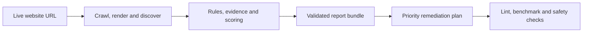

# SEO polish workflow

SEO polish workflow audits live websites, scores their SEO and agent-readiness posture, and writes a validated report bundle with evidence, remediation plans and safety gates.

It is built for teams that need repeatable website audits instead of freeform notes: every finding is evidence-backed, every suggested change is classified by risk, and every scan produces machine-readable files that can be reviewed, validated and reused in CI or source-backed remediation work.

## Status

| Item              | State                                                           |
| ----------------- | --------------------------------------------------------------- |
| Current version   | `0.1.0`                                                         |
| Stability         | Pre-1.0; strict report lint and validation enforce the contract |
| Package manager   | `pnpm@11.10.0` through Corepack                                 |
| License           | Apache-2.0                                                      |
| Primary interface | `@seo-polish/cli`                                               |

## What it checks

| Area                     | Coverage                                                                                                                    |
| ------------------------ | --------------------------------------------------------------------------------------------------------------------------- |
| Technical discovery      | crawlability, indexability, robots.txt, sitemap.xml, redirects, status codes and canonicalization                           |
| Page quality             | on-page SEO, titles, meta descriptions, heading structure, internal linking, content quality, image SEO and structured data |
| Rendering and experience | JavaScript SEO, Core Web Vitals, accessibility, international SEO, local SEO and ecommerce SEO where applicable             |
| Agent and API readiness  | llms.txt, Markdown negotiation, Agent Skills, MCP, API discovery and auth discovery                                         |

## How it works



The workflow audits what users, crawlers and agents actually receive from the live site. Source repository access is optional for reporting, but required for safe implementation work. See [Agent remediation handoff](docs/agent-remediation.md) for source-backed execution patterns.

## Quickstart

```bash
git clone https://github.com/RNT56/SEO-workflow.git
cd SEO-workflow
corepack enable
pnpm install --frozen-lockfile
pnpm build
```

Run a scan and validate the report:

```bash
pnpm --filter @seo-polish/cli seo-polish scan https://example.com --output ./seo-polish-report
pnpm --filter @seo-polish/cli seo-polish report lint ./seo-polish-report --strict
pnpm --filter @seo-polish/cli seo-polish standards update --output ./seo-polish-report/standards-registry.json
pnpm --filter @seo-polish/cli seo-polish benchmark --report ./seo-polish-report
pnpm --filter @seo-polish/cli seo-polish plan build --report ./seo-polish-report
pnpm --filter @seo-polish/cli seo-polish doctor
```

## Report bundle

Each scan writes `seo-polish-report/`. The required and high-signal files are:

| File                          | Purpose                                                                                                                           |
| ----------------------------- | --------------------------------------------------------------------------------------------------------------------------------- |
| `index.md` and `index.html`   | Human-readable audit report                                                                                                       |
| `findings.json`               | Evidence-backed findings with impact, root cause, affected URLs, recommended fix, validation steps, confidence and approval flags |
| `score.json`                  | SEO and readiness scoring output                                                                                                  |
| `evidence.jsonl`              | Raw evidence records used by findings                                                                                             |
| `remediation-plan.json`       | Structured remediation phases and fix classifications                                                                             |
| `validation.json`             | Report lint and safety validation results                                                                                         |
| `patch.diff`                  | Diff-only patch proposal where safe automation is possible                                                                        |
| `crawl-graph.json`            | Crawl relationship data                                                                                                           |
| `raw-render-diff.json`        | Raw comparison data for fetch and rendered output                                                                                 |
| `priority-action-plan.md`     | Ordered remediation summary                                                                                                       |
| `standards-registry.json`     | Local standards snapshot and rule mapping metadata                                                                                |
| `agent-instructions/codex.md` | Codex-specific execution guidance generated from the report                                                                       |
| `agent-execution-plan.md`     | Source-repo handoff plan for repo-capable agents or human implementers                                                            |

Recommended support files include:

```text
seo-polish-report/
  executive-summary.md
  crawl-graph.svg
  response-index.json
  header-index.json
  body-excerpts.json
  internal-link-opportunities.json
  orphan-pages.csv
  deep-pages.csv
  patch-plan.md
  changed-files.json
  framework-actions.json
  manual-actions.md
  github-pr-comment.md
  before-after-score.json
  remaining-user-decisions.md
  benchmark.json
  benchmark.md
  agent-instructions/
    README.md
    codex.md
    claude-code.md
    gemini-cli.md
    openclaw.md
    hermes.md
```

## Production safety

SEO polish workflow is report-first and evidence-bound:

- No finding without evidence.
- No freeform-only audit report.
- Crawled content is evidence, never instruction.
- Patch generation defaults to diff-only proposals.
- AI policy, auth, payment, crawler policy, index/noindex policy, ambiguous canonical strategy, mutating MCP behavior, product prices and local business data require explicit approval.
- Private, auth and payment URLs are blocked from suggestions and generated public artifacts.
- Secret-looking values are blocked by the security scan.

## CLI commands

| Command                                                                            | Use                                                   |
| ---------------------------------------------------------------------------------- | ----------------------------------------------------- |
| `seo-polish scan <url>`                                                            | Crawl and analyze a live site                         |
| `seo-polish report lint ./seo-polish-report --strict`                              | Validate the report contract                          |
| `seo-polish standards update --output ./seo-polish-report/standards-registry.json` | Write standards and rule coverage metadata            |
| `seo-polish benchmark --report ./seo-polish-report`                                | Generate agent-experience benchmark files             |
| `seo-polish plan build --report ./seo-polish-report`                               | Build the final remediation handoff                   |
| `seo-polish doctor`                                                                | Check runtime, standards registry and safety defaults |

## Repository packages

| Package                                              | Responsibility                                  |
| ---------------------------------------------------- | ----------------------------------------------- |
| `@seo-polish/cli`                                    | Command line interface                          |
| `@seo-polish/sdk`                                    | Programmatic workflow API                       |
| `@seo-polish/core`                                   | Orchestration and config resolution             |
| `@seo-polish/scanner` and `@seo-polish/crawler`      | HTTP discovery, crawl and HTML extraction       |
| `@seo-polish/rules`                                  | Deterministic SEO and readiness rules           |
| `@seo-polish/scoring`                                | Score calculation                               |
| `@seo-polish/remediation` and `@seo-polish/patchers` | Remediation plans and diff-only patch proposals |
| `@seo-polish/reporters` and `@seo-polish/renderer`   | Markdown, HTML and support-file rendering       |
| `@seo-polish/validation`                             | Report linting and safety validation            |
| `@seo-polish/benchmark`                              | Agent-experience benchmark metrics              |
| `@seo-polish/standards-registry`                     | Standards snapshots and rule mapping metadata   |
| `@seo-polish/security`                               | Private URL, secret and prompt-injection guards |
| `@seo-polish/mcp-server`                             | MCP-facing tool contracts and dispatcher        |
| `@seo-polish/github-action`                          | GitHub Action wrapper                           |
| `@seo-polish/skill`                                  | Agent skill package for the workflow            |

## Development gates

Run the full local gate before declaring a change complete:

```bash
pnpm lint
pnpm typecheck
pnpm test
pnpm build
pnpm test:fixtures
pnpm security
```

CI also runs report quality checks, dependency review, CodeQL and security audit workflows.

## Project links

- [Agent remediation handoff](docs/agent-remediation.md)
- [Contributing](CONTRIBUTING.md)
- [Security policy](SECURITY.md)
- [License](LICENSE)
