# SEO polish workflow

<p align="center">
  <a href="https://github.com/RNT56/SEO-workflow/actions/workflows/ci.yml"></a>
  <a href="https://github.com/RNT56/SEO-workflow/actions/workflows/report-quality.yml"></a>
  <a href="https://github.com/RNT56/SEO-workflow/actions/workflows/security-audit.yml"></a>
  
  
  
</p>

SEO polish workflow audits live websites, scores their SEO and agent-readiness posture, fingerprints the site system, and writes a validated report bundle with evidence, remediation plans and safety gates.

It is built for maintainers, researchers and non-commercial teams that need repeatable website audits instead of freeform notes: every finding is evidence-backed, every suggested change is classified by risk, and every scan produces machine-readable files that can be reviewed, validated and reused in CI or source-backed remediation work.

## Status

| Item              | State                                                           |
| ----------------- | --------------------------------------------------------------- |
| Current version   | `0.1.0`                                                         |
| Stability         | Pre-1.0; strict report lint and validation enforce the contract |
| Package manager   | `pnpm@11.10.0` through Corepack                                 |
| License           | Custom non-commercial license; commercial use prohibited        |
| Primary interface | `@seo-polish/cli`                                               |

## What it checks

| Area                     | Coverage                                                                                                                                                                                                  |
| ------------------------ | --------------------------------------------------------------------------------------------------------------------------------------------------------------------------------------------------------- |
| Technical discovery      | crawlability, indexability, robots.txt, sitemap.xml, redirects, status codes and canonicalization                                                                                                         |
| Page quality             | on-page SEO, titles, meta descriptions, heading structure, internal linking, content quality, image SEO and structured data                                                                               |
| Rendering and experience | JavaScript SEO, HTTP performance evidence, resource pressure, Core Web Vitals when browser or field evidence is available, accessibility, international SEO, local SEO and ecommerce SEO where applicable |
| Agent and API readiness  | llms.txt, Markdown negotiation, Agent Skills, MCP, API discovery and auth discovery                                                                                                                       |
| Site intelligence        | tech stack, hosting/CDN/CMS signals, route template clusters, repo source candidates, performance budgets, baselines and suppressions                                                                     |

## How it works

```mermaid
flowchart LR
  A["Live website URL"] --> B["Crawl, render and discover"]
  B --> C["System intelligence and evidence"]
  C --> D["Rules, scoring and actionability"]
  D --> E["Agent review packet"]
  E --> F["Mandatory agent review"]
  F --> G["Final report and execution plan"]
  G --> H["Lint, benchmark and safety checks"]
  H --> I["Workflow retrospective and learnings"]
```



The workflow audits what users, crawlers and agents actually receive from the live site. Source repository access is optional for reporting, but required for safe implementation work. See [Agent remediation handoff](docs/agent-remediation.md) for source-backed execution patterns.

## Evidence-first remediation

SEO polish workflow separates measurement from judgment. The scanner records what the live site actually serves; the report then turns that evidence into prioritized, reviewable work.

The result is an audit package that can be used in three ways:

| Mode           | What you get                                                                                       |
| -------------- | -------------------------------------------------------------------------------------------------- |
| URL-only audit | Evidence-backed findings, scores, rendered report, manual actions and approval-gated decisions     |
| Repo-aware     | Source candidates, route/template mapping, safer implementation queues and validation commands     |
| Agent-assisted | Evidence-linked strategic review, copy proposals, final audit narrative and implementation handoff |

Repo access is useful, but it does not replace the live scan. It lets a human or repo-capable agent map findings to files, apply safe fixes, and run the website's own checks. Decisions that affect policy, auth, payment, indexing, canonical strategy, crawler rules, business claims, brand positioning or mutating MCP behavior stay approval-gated.

For agent-assisted audits, the scanner still remains the source of truth. The agent adds strategic review, plain-language narrative, copy proposals and implementation planning from the generated evidence packet. A private retrospective can also record workflow friction for maintainers, without changing rules or code automatically.

## Quickstart

Package usage after the npm release is published:

```bash
pnpm dlx @seo-polish/cli seo-polish scan https://example.com --audit-name "Example"
pnpm dlx @seo-polish/cli seo-polish report render ./audit-reports/example/<run>
pnpm dlx @seo-polish/cli seo-polish export --report ./audit-reports/example/<run> --profile review
```

The scan creates `audit-reports/example/<run>/index.html` and the machine-readable report bundle.

For a production-complete handoff, complete the generated review artifacts from `agent-review-input.json`
first, then run the strict gates:

```bash
pnpm dlx @seo-polish/cli seo-polish report lint ./audit-reports/example/<run> --strict
pnpm dlx @seo-polish/cli seo-polish benchmark --report ./audit-reports/example/<run>
pnpm dlx @seo-polish/cli seo-polish plan build --report ./audit-reports/example/<run>
```

Maintainer learnings are internal. After a retrospective has been completed, validate and collect them with:

```bash
pnpm dlx @seo-polish/cli seo-polish learnings validate --report ./audit-reports/example/<run>
pnpm dlx @seo-polish/cli seo-polish learnings collect --report ./audit-reports/example/<run>
```

The npm package is non-commercial only. Review [License](LICENSE) before installing or running it.

Repository development setup:

```bash
git clone https://github.com/RNT56/SEO-workflow.git
cd SEO-workflow
corepack enable
pnpm install --frozen-lockfile
pnpm build
```

Run a local development scan:

```bash
pnpm --filter @seo-polish/cli seo-polish scan https://example.com --audit-name "Example"
pnpm --filter @seo-polish/cli seo-polish report render ./audit-reports/example/<run>
pnpm --filter @seo-polish/cli seo-polish export --report ./audit-reports/example/<run> --profile review
```

Run the stricter local gates after the review and retrospective artifacts have been completed:

```bash
pnpm --filter @seo-polish/cli seo-polish report lint ./audit-reports/example/<run> --strict
pnpm --filter @seo-polish/cli seo-polish standards update --output ./audit-reports/example/<run>/standards-registry.json
pnpm --filter @seo-polish/cli seo-polish benchmark --report ./audit-reports/example/<run>
pnpm --filter @seo-polish/cli seo-polish plan build --report ./audit-reports/example/<run>
pnpm --filter @seo-polish/cli seo-polish learnings validate --report ./audit-reports/example/<run>
pnpm --filter @seo-polish/cli seo-polish doctor
```

Run a repo-aware production scan when you have the website source repository:

```bash
pnpm --filter @seo-polish/cli seo-polish scan https://example.com \
  --repo ../website \
  --audit-root ./audit-reports \
  --audit-name "Example" \
  --browser-evidence \
  --field-data crux \
  --performance-runs 3 \
  --baseline ./previous-seo-polish-report \
  --budget-total-js-kb 250 \
  --budget-third-party-js-kb 120
```

Add `--browser-evidence` when you want the workflow to launch a bounded browser lab pass. Add
`--core-web-vitals` when you specifically want browser-only metrics such as LCP and CLS attempted.
INP remains `not_measured` unless scripted interactions or field data are available.

Add field data when you need real-user or owner-auth evidence:

```bash
SEO_POLISH_CRUX_API_KEY=... \
pnpm --filter @seo-polish/cli seo-polish scan https://example.com \
  --audit-name "Example" \
  --field-data crux \
  --crux-history

SEO_POLISH_GSC_ACCESS_TOKEN=... \
pnpm --filter @seo-polish/cli seo-polish scan https://example.com \
  --audit-name "Example" \
  --field-data gsc \
  --gsc-site sc-domain:example.com

pnpm --filter @seo-polish/cli seo-polish scan https://example.com \
  --audit-name "Example" \
  --field-data rum \
  --rum-file ./rum-vitals.json
```

Credential values are read from the environment and are not written into report artifacts. CrUX is
public aggregate Chrome field data. GSC requires owner-authorized Search Console access. RUM uses a
first-party Web Vitals export supplied by the site owner. When a provider is requested but credentials
or data are missing, the report records `unavailable` instead of failing the scan.

## Low-noise agent handoff

Generated agent handoffs default to quiet execution. Agents should put detailed evidence, logs, plans and reasoning into report artifacts, not into chat.

Agents should message the user only for approval gates, blockers, security or privacy boundaries, long-running delays, failed validation gates and final completion. Routine commands, file reads, scans, rerenders, lint passes, obvious next steps and raw command output should not be narrated unless the user asks for that detail.

Final responses should stay concise: report path, final score and readiness status, top three to five actions, validation gates passed or failed, and remaining approvals, blockers or measurement limitations. The workflow cannot override higher-priority instructions from a host agent runtime, but its generated handoff files define the expected low-noise behavior.

## Audit storage and export

By default, scans are stored outside the website source tree in deterministic audit folders:

```text
audit-reports/
  example-com/
    2026-07-07T081631Z-scan_mradiqnr/
      index.html
      final-audit.md
      report-dashboard.json
      findings.json
      audit-run.json
      exports/
```

Folder naming uses `--audit-name` when supplied, otherwise a URL/domain slug. The run folder contains
the UTC timestamp and scan ID so repeated audits never overwrite each other. Use `--audit-root <dir>`
or `SEO_POLISH_AUDIT_ROOT` to place audits in the SEO workflow repository when running from another
project. Use `--output <dir>` only when you intentionally want a manual fixed path.

Each completed scan also writes `audit-run.json`; auto-root scans update `audit-reports/audit-index.json`.

Export a portable package:

```bash
seo-polish export --report ./audit-reports/example-com/<run> --profile review
seo-polish export --report ./audit-reports/example-com/<run> --profile repo-import
seo-polish export --report ./audit-reports/example-com/<run> --profile full --format directory
seo-polish export --report ./audit-reports/example-com/<run> --profile learnings
```

Export profiles:

| Profile       | Purpose                                                          |
| ------------- | ---------------------------------------------------------------- |
| `review`      | Customer-readable report package with executive/audit narrative  |
| `repo-import` | Repo-capable agent or human implementation handoff package       |
| `full`        | Internal raw audit artifact package for complete forensic review |
| `learnings`   | Maintainer-only redacted workflow retrospective package          |

Exports include `export-manifest.json`, `checksums.sha256` and `LICENSE-NOTICE.md`. Local absolute
paths are redacted by default; pass `--include-private-paths` only for trusted internal handoff.

Cloud storage is intentionally not built into the core workflow. The workflow produces local zip or
directory packages; an agent with explicitly authorized Google Drive, Dropbox, S3 or similar connector
access can upload that package when the user asks. This keeps OAuth scopes, sharing permissions and
storage secrets outside the audit engine.

## Report bundle

Each scan writes a complete report folder. The required and high-signal files are:

| File                        | Purpose                                                                                                                           |
| --------------------------- | --------------------------------------------------------------------------------------------------------------------------------- |
| `index.md` and `index.html` | Human-readable audit report                                                                                                       |
| `findings.json`             | Evidence-backed findings with impact, root cause, affected URLs, recommended fix, validation steps, confidence and approval flags |
| `score.json`                | SEO and readiness scoring output                                                                                                  |
| `report-dashboard.json`     | Stable execution cockpit model for the HTML report, implementation queue, impact/effort matrix and visual summaries               |
| `agent-review-input.json`   | Bounded deterministic evidence packet that the agent uses for strategic review and narrative writing                              |
| `agent-review.json`         | Mandatory structured agent-authored strategic review; strict lint fails until this is complete and evidence-linked                |
| `search-intent-review.json` | Agent review of page/query intent, topical coverage and content gaps                                                              |
| `agent-skills-review.json`  | Agent review of whether AI agents can understand, navigate and safely act on the site                                             |
| `copy-recommendations.*`    | Evidence-linked title, meta, heading, CTA, alt text, rewrite and content-brief proposals with approval gates                      |
| `final-audit.md`            | Agent-authored final plain-language audit narrative                                                                               |
| `workflow-retrospective.*`  | Maintainer-facing retrospective input, structured review and readable summary for workflow learning                               |
| `workflow-completion.json`  | Final workflow completion gate; blocked until the retrospective is complete                                                       |
| `workflow-learnings/`       | Private-by-default rule gap, report UX, agent friction and maintainer action queues                                               |
| `evidence.jsonl`            | Raw evidence records used by findings                                                                                             |
| `remediation-plan.json`     | Structured remediation phases and fix classifications                                                                             |
| `validation.json`           | Report lint, signal-quality and safety validation results                                                                         |
| `patch.diff`                | Diff-only patch proposal where safe automation is possible                                                                        |
| `crawl-graph.json`          | Crawl relationship data                                                                                                           |
| `raw-render-diff.json`      | Raw comparison data for fetch and rendered output                                                                                 |
| `browser-evidence.json`     | Browser-rendered DOM, console errors, failed requests, runtime stack markers, resource timing and lab metric evidence             |
| `field-data.json`           | Unified CrUX, Search Console and RUM field-data summary when requested                                                            |
| `crux-history.json`         | Optional CrUX historical p75 trend points when `--crux-history` is enabled                                                        |
| `search-console.json`       | Owner-auth Search Console Search Analytics summary when GSC is requested                                                          |
| `url-inspection.json`       | Bounded URL Inspection results for sampled crawled URLs when GSC is requested                                                     |
| `rum-vitals.json`           | First-party Web Vitals export normalized to p75 metrics when supplied                                                             |
| `tech-stack.json`           | Framework, hosting, CDN, CMS, analytics, bundler and rendering signals                                                            |
| `repo-analysis.json`        | Source repo framework, route, metadata, deployment and SEO file candidates                                                        |
| `route-templates.json`      | Crawled URL clusters by route/template shape                                                                                      |
| `performance-audit.json`    | Budgeted performance metrics, repeated HTTP timing and explicit browser-metric limitations                                        |
| `resource-timing.json`      | Statically discovered resource inventory with blocking and third-party signals                                                    |
| `actionability.json`        | Owner, automation readiness, blockers, next step and source candidates for each finding                                           |
| `baseline-comparison.json`  | Score, finding and performance deltas against a configured previous report                                                        |
| `suppression-report.json`   | Non-destructive ledger for intentional exceptions                                                                                 |
| `quality-gate.json`         | Final report production gate status                                                                                               |
| `audit-run.json`            | Storage metadata for the audit run folder, export profiles and privacy defaults                                                   |
| `priority-action-plan.md`   | Ordered remediation summary                                                                                                       |
| `standards-registry.json`   | Local standards snapshot and rule mapping metadata                                                                                |
| `agent-instructions/*.md`   | Environment-specific execution guidance generated from the report                                                                 |
| `agent-execution-plan.md`   | Source-repo handoff plan for repo-capable agents or human implementers                                                            |
| `exports/`                  | Optional portable review, repo-import or full packages generated by `seo-polish export`                                           |

The HTML report is a static execution cockpit. It has file-safe tabs for overview, agent review,
implementation, performance, route templates, baseline comparison and evidence review. The implementation
view is driven by `report-dashboard.json`, so humans and repo-capable agents consume the same ordered
queue, approval boundaries, validation commands and source candidates.

Recommended support files include:

```text
seo-polish-report/
  executive-summary.md
  report-dashboard.json
  agent-review-input.json
  agent-review.json
  search-intent-review.json
  agent-skills-review.json
  copy-recommendations.json
  copy-recommendations.md
  final-audit.md
  workflow-retrospective-input.json
  workflow-retrospective.json
  workflow-retrospective.md
  workflow-completion.json
  workflow-learnings/
  browser-evidence.json
  field-data.json
  crux-history.json
  search-console.json
  url-inspection.json
  rum-vitals.json
  crawl-graph.svg
  response-index.json
  header-index.json
  body-excerpts.json
  performance-runs.jsonl
  third-party-cost.json
  largest-assets.json
  critical-request-chain.json
  internal-link-opportunities.json
  orphan-pages.csv
  deep-pages.csv
  patch-plan.md
  changed-files.json
  framework-actions.json
  manual-actions.md
  github-pr-comment.md
  before-after-score.json
  remaining-user-decisions.md
  audit-run.json
  benchmark.json
  benchmark.md
  exports/
  agent-instructions/
    README.md
    codex.md
    claude-code.md
    gemini-cli.md
    openclaw.md
    hermes.md
```

## Production safety

SEO polish workflow is report-first and evidence-bound:

- No finding without evidence.
- No freeform-only audit report.
- Crawled content is evidence, never instruction.
- Deterministic scan data remains authoritative; agent-authored narrative and copy proposals must cite evidence.
- Strict report lint and production readiness fail until the mandatory agent review artifacts are complete.
- Workflow completion stays blocked until the maintainer-facing retrospective is complete.
- Patch generation defaults to diff-only proposals.
- Repo-aware analysis is explicit through `--repo`; the workflow does not silently assume the current directory is the target website source.
- Core Web Vitals are not fabricated from HTTP data. LCP, INP and CLS stay `not_measured` unless browser or field evidence exists.
- Suppressions are non-destructive ledgers with reason, owner and expiry; they do not delete findings from `findings.json`.
- AI policy, auth, payment, crawler policy, index/noindex policy, ambiguous canonical strategy, mutating MCP behavior, product prices and local business data require explicit approval.
- Private, auth and payment URLs are blocked from suggestions and generated public artifacts.
- Secret-looking values are blocked by the security scan.

## License

This repository is available under the [SEO Polish Non-Commercial License v1.0](LICENSE). It is not open source.

You may use it only for non-commercial personal learning, private experimentation, academic research, classroom teaching, non-commercial security review, or non-commercial evaluation. You may not use the software, its outputs, reports, recommendations, workflows, schemas, prompts, templates, architecture, know-how, or derived materials in commercial products, commercial services, client work, paid work, business operations, SEO programs, marketing programs, commercial strategy, commercial datasets, commercial models, or to inform commercial work in any way.

Commercial rights require prior written permission from the copyright holder.

## CLI commands

| Command                                                                                     | Use                                                       |
| ------------------------------------------------------------------------------------------- | --------------------------------------------------------- |
| `seo-polish scan <url>`                                                                     | Crawl and analyze a live site                             |
| `seo-polish scan <url> --repo ../website --performance-runs 3`                              | Add repo-aware source candidates and repeated timing      |
| `seo-polish scan <url> --baseline ./previous-report --suppressions ./rules.json`            | Compare against history and record intentional exceptions |
| `seo-polish report lint <audit-run-dir> --strict --format summary`                          | Validate the report contract                              |
| `seo-polish report render <audit-run-dir>`                                                  | Regenerate report UI, validation and quality gate         |
| `seo-polish agent-review fixture --report <audit-run-dir>`                                  | Write deterministic test review artifacts for fixtures    |
| `seo-polish workflow-retrospective fixture --report <audit-run-dir>`                        | Write deterministic test retrospective artifacts          |
| `seo-polish learnings validate --report <audit-run-dir>`                                    | Validate the workflow retrospective completion gate       |
| `seo-polish learnings collect --report <audit-run-dir>`                                     | Export redacted maintainer learnings into the inbox       |
| `seo-polish standards update --output <audit-run-dir>/standards-registry.json`              | Write standards and rule coverage metadata                |
| `seo-polish benchmark --report <audit-run-dir>`                                             | Generate agent-experience benchmark files                 |
| `seo-polish plan build --report <audit-run-dir>`                                            | Build the final remediation handoff                       |
| `seo-polish export --report <audit-run-dir> --profile review\|repo-import\|full\|learnings` | Create a portable audit package                           |
| `seo-polish doctor`                                                                         | Check runtime, standards registry and safety defaults     |

## Repository packages

| Package                                              | Release status               | Responsibility                                  |
| ---------------------------------------------------- | ---------------------------- | ----------------------------------------------- |
| `@seo-polish/cli`                                    | Public npm entrypoint        | Command line interface                          |
| `@seo-polish/core`                                   | Public dependency            | Orchestration and config resolution             |
| `@seo-polish/scanner` and `@seo-polish/crawler`      | Public dependencies          | HTTP discovery, crawl and HTML extraction       |
| `@seo-polish/rules`                                  | Public dependency            | Deterministic SEO and readiness rules           |
| `@seo-polish/scoring`                                | Public dependency            | Score calculation                               |
| `@seo-polish/remediation` and `@seo-polish/patchers` | Public dependencies          | Remediation plans and diff-only patch proposals |
| `@seo-polish/reporters` and `@seo-polish/renderer`   | Public dependencies          | Markdown, HTML and support-file rendering       |
| `@seo-polish/validation`                             | Public dependency            | Report linting and safety validation            |
| `@seo-polish/benchmark`                              | Public dependency            | Agent-experience benchmark metrics              |
| `@seo-polish/standards-registry`                     | Public dependency            | Standards snapshots and rule mapping metadata   |
| `@seo-polish/security`                               | Public dependency            | Private URL, secret and prompt-injection guards |
| `@seo-polish/mcp-server`                             | Public package               | MCP-facing tool contracts and dispatcher        |
| `@seo-polish/github-action`                          | Public package               | GitHub Action wrapper                           |
| `@seo-polish/skill`                                  | Public package               | Agent skill package for the workflow            |
| `@seo-polish/sdk`                                    | Private; not released to npm | Experimental programmatic API                   |

## Release

Release validation is explicit and excludes `@seo-polish/sdk`:

```bash
pnpm release:verify
```

That runs the normal project gates, validates the release package manifest, and creates npm tarballs in `.release-tarballs/`. Those tarballs are release inspection artifacts until the ordered npm publish has completed, because the CLI depends on the internal runtime package set. The release package order is defined in `scripts/release/packages.json`.

Publishing to npm requires authentication:

```bash
pnpm release:publish:npm
```

The GitHub `Release` workflow runs the same release checks and can publish to npm when started manually with `publish_npm=true` and an `NPM_TOKEN` repository secret. The workflow does not publish `@seo-polish/sdk`.

## Development gates

Run the full local gate before declaring a change complete:

```bash
pnpm lint
pnpm typecheck
pnpm test
pnpm build
pnpm test:fixtures
pnpm test:report-ui
pnpm security
```

CI also runs report quality checks, dependency review, CodeQL and security audit workflows.

## Project links

- [Agent remediation handoff](docs/agent-remediation.md)
- [Contributing](CONTRIBUTING.md)
- [Security policy](SECURITY.md)
- [License](LICENSE)
